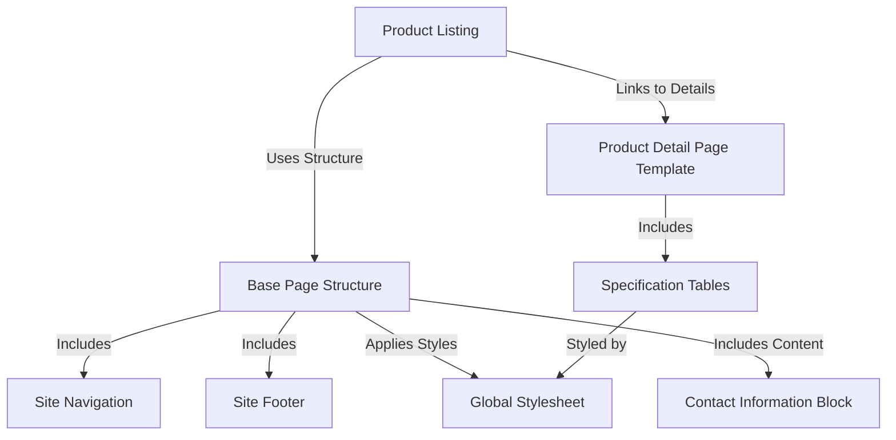

# Tutorial: Rhyno-Ev

The Rhyno-Ev project is a website designed to showcase their **electric scooters**.
It allows visitors to *browse available models*, view detailed technical *specifications* presented in clear tables, find *contact information*, and navigate the site easily using consistent navigation bars at the *top and bottom* of every page, all tied together with a *unified visual style*.

## Visual Overview

## Chapters

1. [Base Page Structure
](01_base_page_structure_.md)
2. [Global Stylesheet
](02_global_stylesheet_.md)
3. [Site Navigation
](03_site_navigation_.md)
4. [Site Footer
](04_site_footer_.md)
5. [Contact Information Block
](05_contact_information_block_.md)
6. [Product Listing
](06_product_listing_.md)
7. [Product Detail Page Template
](07_product_detail_page_template_.md)
8. [Specification Tables
](08_specification_tables_.md)

---

Generated by [AI Codebase Knowledge Builder](https://github.com/The-Pocket/Tutorial-Codebase-Knowledge).
