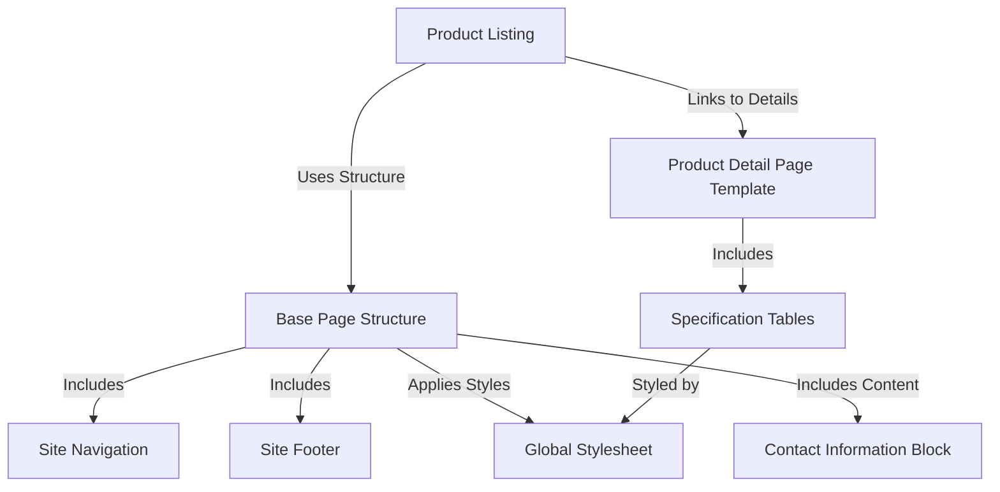

# Tutorial: Rhyno-Ev

The Rhyno-Ev project is a website designed to showcase their **electric scooters**.
It allows visitors to *browse available models*, view detailed technical *specifications* presented in clear tables, find *contact information*, and navigate the site easily using consistent navigation bars at the *top and bottom* of every page, all tied together with a *unified visual style*.

## Visual Overview

